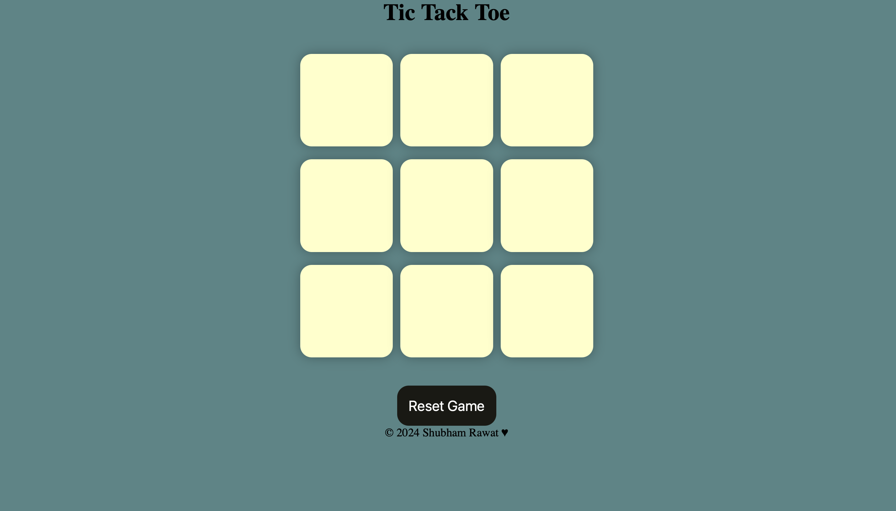
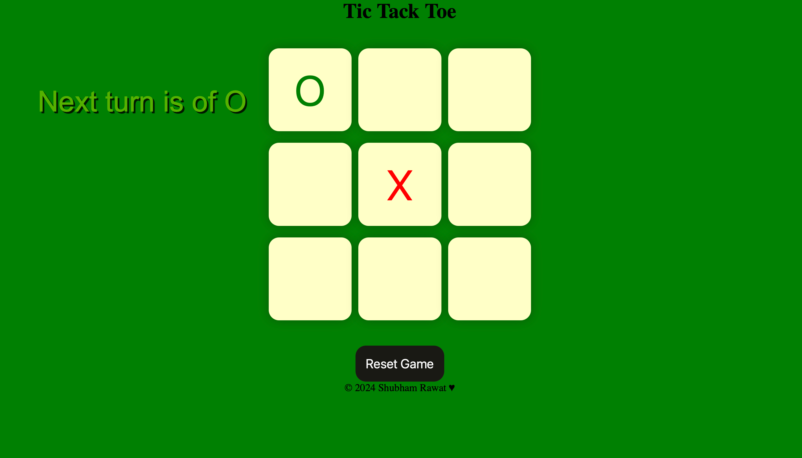
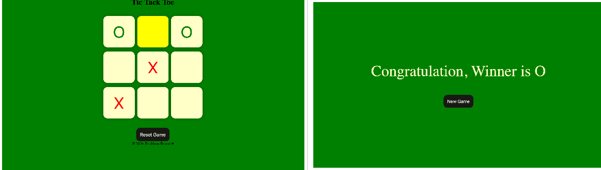
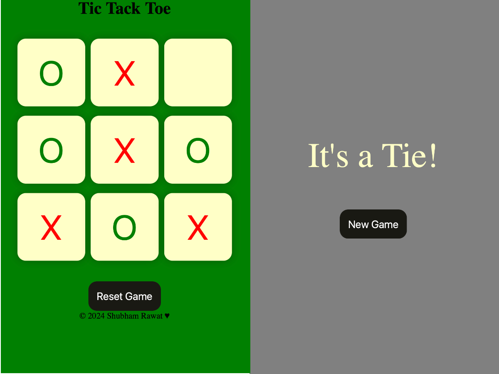

# Tic Tac Toe Game  

This is a simple, interactive Tic Tac Toe game developed using HTML, CSS, and JavaScript. Designed for two players, it features winner detection, tie handling, and the ability to reset or start a new game. With a responsive design, the game is playable on desktop and mobile devices.

## Features  
### 🎮 **Gameplay**  
- **Two-player Mode**: Players take turns marking their symbols (X or O) on the game board.  
- **Win Detection**: Automatically checks for three matching symbols in a row, column, or diagonal.  
- **Tie Handling**: Declares a tie if the board fills up without a winner.  
- **Reset and New Game**: Restart the game at any time using the reset button or start fresh with the new game button.  

### 🌟 **User Interface**  
- **Responsive Design**: Ensures smooth gameplay on both desktop and mobile devices.  
- **Dynamic Background**: Changes background color to indicate the current player's turn.  
- **Clean Layout**: Minimalistic design with a focus on usability and aesthetics.  

### 📱 **Compatibility**  
- Works across different screen sizes, ensuring a consistent experience on phones, tablets, and computers.  

---

## Screenshots  
### 1. **Game Start**  
  

### 2. **Player Turn**  
  

### 3. **Winner Announcement**  
  

### 4. **Game Tie**  
  


## How It Works  
1. The game starts with Player O's turn.  
2. Players take turns clicking on boxes to place their markers (X or O).  
3. The game detects the winner when three symbols align horizontally, vertically, or diagonally.  
4. If all boxes are filled without a winner, the game announces a tie.  
5. Use the **Reset** or **New Game** button to restart.  

---

## File Structure  
- `index.html`: Defines the game structure, buttons, and messages.  
- `style.css`: Styles the game board, buttons, and layout for responsiveness.  
- `app.js`: Implements game logic, turn handling, and winner detection.  

---

## How to Run  
1. Clone this repository:  
   ```bash
   git clone https://github.com/your-username/tic-tac-toe.git
2. Navigate to the project directory:  
   ```bash
   cd tic-tac-toe
3.Open the `index.html` file in your browser.
<h2>Technologies Used</h2>
<ul>
  <li><strong>HTML:</strong> Structure and layout of the game.</li>
  <li><strong>CSS:</strong> Styling and responsive design.</li>
  <li><strong>JavaScript:</strong> Game logic and interactivity.</li>
</ul>

<h2>Future Enhancements</h2>
<ul>
  <li>Add a single-player mode with an AI opponent.</li>
  <li>Include additional game themes and styles.</li>
  <li>Add animations for winner announcements and transitions.</li>
</ul>

<h2>Author</h2>
<p>Created by <strong>Shubham Rawat</strong>.</p>

